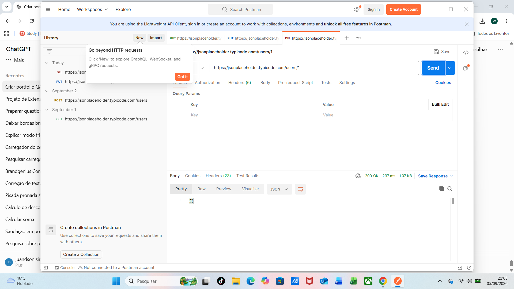

# API-004 - Excluir usuário

**Método:** DELETE  
**Endpoint:** `https://jsonplaceholder.typicode.com/users/1`

## Objetivo

Validar se a API permite excluir um usuário existente por meio de uma requisição DELETE.

## Resultado esperado

- Requisição processada com sucesso
- Status HTTP `200 OK`
- Resposta sem erro
- Usuário identificado pelo `id: 1` processado para exclusão

## Resultado obtido

A API processou com sucesso a exclusão do usuário identificado pelo `id: 1`.

Status HTTP retornado: `200 OK`.

A resposta foi retornada sem erro, com corpo vazio em formato JSON: `{}`.

## Status

✅ PASS

## Evidência

Evidência da execução realizada no Postman.

